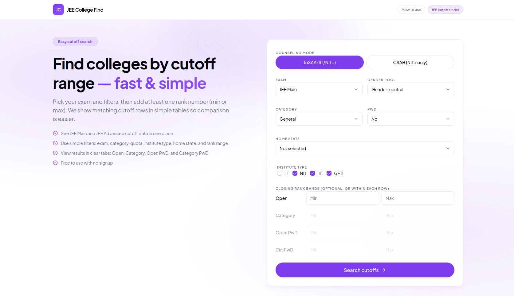

# JEE College Find For Me



**JEE College Find For Me** is an advanced, fast, and open-source search engine tailored for Indian engineering aspirants. It helps students explore, filter, and analyze past cutoffs for **JoSAA** (Joint Seat Allocation Authority) and **CSAB** (Central Seat Allocation Board) counseling processes. Whether you are aiming for an IIT, NIT, IIIT, or GFTI via JEE Main or JEE Advanced, this tool streamlines your college research. 

Built with a high-performance **Go API** and a modern **Next.js frontend**, it lets you filter official-style cutoff data seamlessly. You can search by exam type, category, quotas (Home State, Other State, All India, etc.), gender pool, and closing-rank bands—all without the hassle of signing up. Leverage accurate category ranks for JoSAA and Common Rank List (CRL) for CSAB to make data-driven decisions for your college choices.

## Getting Started

The easiest way to run the full stack (backend API, frontend UI, and Caddy reverse proxy) is using Docker Compose.

### Development Mode
Runs the frontend with hot-reload and exposes the API locally.
```bash
docker compose -f docker-compose.dev.yml up
```
- **Frontend:** [http://localhost:3000](http://localhost:3000)
- **API Health:** [http://localhost:8080/api/health](http://localhost:8080/api/health)

### Production Mode
Builds optimized production images and serves everything behind Caddy.
```bash
docker compose up --build -d
```
- The frontend will be available at `http://localhost` (or `https://localhost` with local certificates).
- The API is proxy-routed to `/api/*`.

To deploy on a real host with a domain:
```bash
SERVICE_DOMAIN=yourdomain.com docker compose up --build -d
```

## Monorepo Layout

| Path | Role |
|------|------|
| `backend/` | Go HTTP API, loads JoSAA/CSAB CSVs into an in-memory SQLite DB at startup |
| `frontend/` | Next.js UI with a search form, results tables, and state persistence |
| `data-processing/` | Offline scripts to parse scraped JoSAA/CSAB text data into CSV artifacts |

## Features

- **Search:** JoSAA (Category Ranks) vs CSAB (CRL Ranks), JEE Main vs Advanced, quotas, categories, and rank bands.
- **State Persistence:** Form state is preserved via `sessionStorage` for seamless navigation.
- **Shareable Links:** Results URLs contain the query state encoded in base64url, allowing for easy sharing.
- **No Sign-up Required:** Fully open access to data exploration.

## Known Limits

- B.Arch / B.Planning rows are excluded during backend DB import.
- IIT preparatory (`P`-suffix rank) rows are excluded during backend DB import.
- *Disclaimer:* Not official JoSAA software; meant for exploratory planning only.

## Running Separately (Without Docker)

You can run the API and frontend independently for local development.

**Terminal 1 — Backend:**
```bash
cd backend
go mod download
go run ./cmd/server
```

**Terminal 2 — Frontend:**
```bash
cd frontend
bun install
bun run dev
```

*Note: If the frontend and backend are on different origins, set `NEXT_PUBLIC_BACKEND_API_URL=http://127.0.0.1:8080` in `frontend/.env.local`.*

## Regenerating Data

When raw text inputs change under `data-processing/data/cutoffs/` or `data-processing/data/dasa&csab/`:

```bash
cd data-processing
bun install
bun run parse:cutoffs:all
```
Restart the backend to load the updated CSV artifacts.

## Further Reading

- `ALGORITHM.md` — Quota/home-state rules and backend cutoff-query logic.
- `backend/README.md` & `frontend/README.md` — Detailed documentation for specific stack elements.

## Contributing

Feel free to fork, make changes, and open a PR. If you find a bug or have an idea, drop an issue. This project is for everyone, so jump right in!

## License

Use it man, it is for you. Do whatever you want with it.
